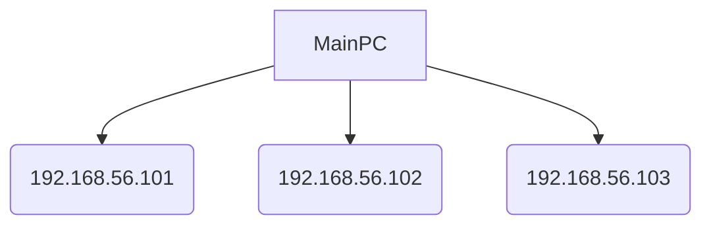

### 환경


metallb 0.12.1 설정



```bash
helm pull metallb/metallb --version=0.12.1
```



아래와 같이 Main PC에 VM3개를 띄워 cluster를 구축했다고 가정했을 때







LoadBalanacer에 사용할 ip 대역을 192.168.56.150~192.168.56.180으로 설정하려고 한다.

1. LoadBalancer에 할당할 외부에서 접속 가능한 IP 대역 지정하기
undefined2. 헬름을 이용해 MetalLB 설치
