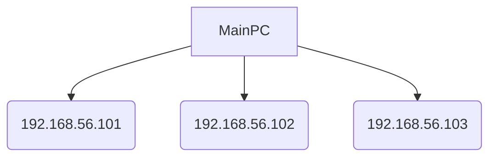

### 환경


metallb 0.12.1 설정



```bash
helm pull metallb/metallb --version=0.12.1
```



아래와 같이 Main PC에 VM3개를 띄워 cluster를 구축했다고 가정했을 때







LoadBalanacer에 사용할 ip 대역을 192.168.56.150~192.168.56.180으로 설정하려고 한다.

1. LoadBalancer에 할당할 외부에서 접속 가능한 IP 대역 지정하기
2. 로드밸런서 용도로 사용할 IP 대역 지정. 외부에서 접속이 가능한대역으로 할당한다.
3. 이때 cluster 외부 네트워크는 위 네트워크맵 상 MainPC 접근가능하다는 것은 MainPC기준으로 살펴봤을 때 192.168.56.0/24 subnet을 MainPC가 접근 가능하게 하면 성공이다.
undefined4. metallb configMap에 들어가 값 변경 (chart 수정)
undefined5. 헬름을 이용해 MetalLB 설치
