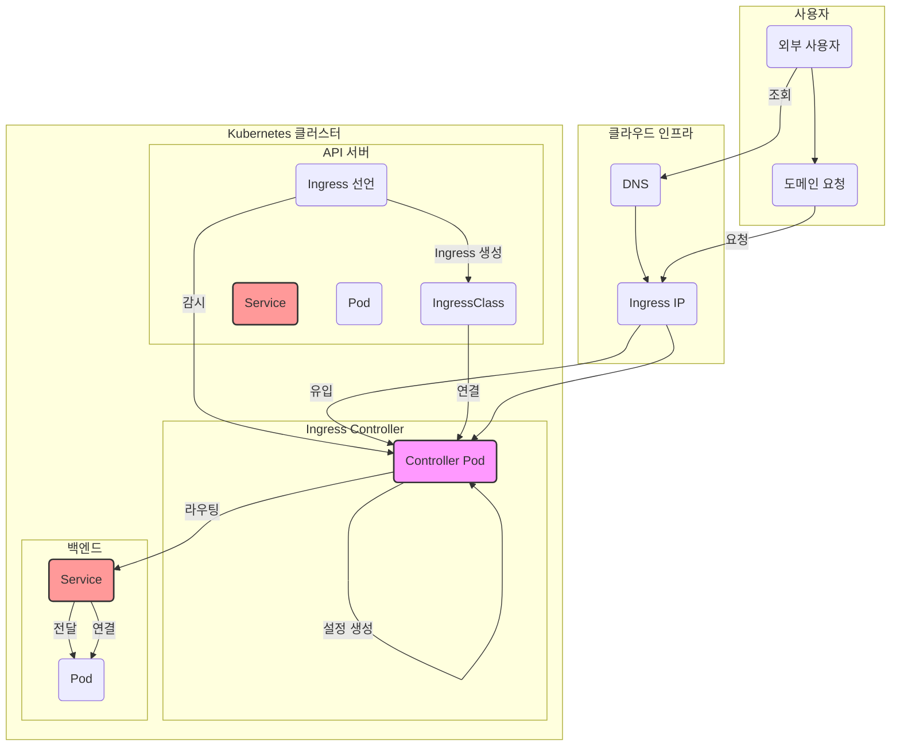

Kubernetes에서 외부 트래픽을 클러스터 내부 서비스로 라우팅하는 핵심 리소스인 **Ingress**. 이를 제대로 이해하기 위해서는 **Ingress Controller**와 **Ingress Class**의 역할을 명확히 알아야 합니다. 이 포스팅에서는 이 두 가지 개념을 기술적으로 깊이 있게 살펴보고, 실제 트래픽이 어떻게 흐르는지 상세히 설명합니다.

---

# Ingress Class와 Ingress Controller: 둘의 관계와 트래픽 흐름





위 그림은 Kubernetes에서 외부 트래픽이 Ingress를 통해 백엔드 서비스로 전달되는 과정을 시각적으로 보여줍니다. 사용자가 DNS를 통해 도메인에 접근하면, 요청은 클러스터 외부의 Ingress Service IP로 전달되어 Ingress Controller Pod로 유입됩니다. 동시에, Kubernetes API는 사용자가 정의한 Ingress 리소스의 규칙을 Ingress Controller Pod에게 전달하며, Ingress Class를 통해 특정 컨트롤러가 이 규칙을 처리하도록 지정합니다.

Ingress Controller Pod는 API로부터 받은 규칙을 바탕으로 NGINX 설정을 동적으로 업데이트하고, 유입된 트래픽을 이 설정에 따라 올바른 백엔드 Service로 라우팅합니다. 이 Service는 최종적으로 요청을 백엔드 Pod에 분산시켜 처리하게 됩니다. 이 전체 과정은 Ingress 리소스의 선언만으로 자동으로 이루어져, 복잡한 네트워크 구성을 효율적으로 관리할 수 있게 해줍니다.

### Ingress Controller: 동적 라우팅을 구현하는 Pod 애플리케이션

**Ingress Controller**는 Ingress 리소스에 정의된 규칙을 실제로 구현하는 애플리케이션입니다. NGINX, Traefik, Istio 등 다양한 Ingress Controller가 존재하며, 이들은 일반적인 클러스터 애플리케이션처럼 **Deployment**를 통해 Pod 형태로 배포됩니다.

- **배포 구조**: Ingress Controller는 Deployment, Service 등을 통해 클러스터에 배포됩니다. 특히, Controller Pod는 Kubernetes API 서버와 연결되어 Ingress 리소스를 비롯한 관련 리소스(Service, Endpoint 등)의 변경 사항을 실시간으로 감시합니다.
- **동적 설정**: 컨트롤러는 Ingress 리소스에 정의된 호스트, 경로, 백엔드 서비스 등의 정보를 기반으로 자체 프록시 설정 파일을 동적으로 생성하고, 이를 NGINX와 같은 프록시 서버에 적용합니다. 이 과정은 트래픽 중단 없이 `reload` 시그널을 통해 이루어집니다.

이를 통해 사용자는 Ingress 리소스만 선언하면, 컨트롤러가 자동으로 복잡한 라우팅 설정을 처리해주는 셈입니다.

---

### Ingress Class: 컨트롤러를 지정하는 표준 API 오브젝트

**Ingress Class**는 클러스터 내에 여러 개의 Ingress Controller가 존재할 때, 특정 Ingress 리소스가 어떤 컨트롤러에 의해 처리되어야 하는지를 명시하는 **표준 API 오브젝트**입니다. 이는 CRD(사용자 정의 리소스)가 아닌, Kubernetes의 **내장(built-in) 리소스**입니다.

- **관계 설정**: Ingress 리소스의 `spec.ingressClassName` 필드에 Ingress Class의 이름을 지정하면, 해당 클래스와 연결된 컨트롤러가 Ingress 규칙을 처리하게 됩니다.
- **다중 컨트롤러 관리**: Ingress Class 덕분에 한 클러스터 내에서 서로 다른 목적을 가진 여러 컨트롤러를 동시에 운영할 수 있습니다. 예를 들어, `nginx` 클래스는 내부용 트래픽을, `haproxy` 클래스는 외부용 트래픽을 처리하도록 구성할 수 있습니다.

---

### Ingress 리소스 선언 및 동작 흐름 (End-to-End)

Ingress 리소스의 선언부터 실제 트래픽이 서비스에 도달하는 과정은 다음과 같습니다.

1. **Ingress 리소스 선언**: 사용자는 Ingress 리소스에 `spec.ingressClassName`, `spec.rules` 등을 정의하여 원하는 라우팅 규칙을 명시합니다. 이 매니페스트는 `kubectl apply`를 통해 클러스터에 배포됩니다.
2. **컨트롤러의 감지**: **NGINX Ingress Controller Pod**는 Kubernetes API 서버를 '감시(Watch)'하고 있다가, 새로운 Ingress 리소스가 생성된 것을 감지합니다.
3. **동적 설정 재구성**: 컨트롤러는 감지된 Ingress 리소스의 `ingressClassName`을 확인합니다. 자신의 클래스(`nginx`)와 일치하면, 해당 리소스의 규칙을 파싱하여 NGINX의 설정 파일(`nginx.conf`)을 재구성합니다.
4. **트래픽 유입 및 라우팅**:
undefined5. **백엔드 서비스 연결**: NGINX는 최종적으로 요청을 Ingress 리소스에 정의된 백엔드 서비스(`my-app-service`)로 전달하고, Service는 Pod로 트래픽을 분산시킵니다.

이 과정을 통해 Ingress Class와 Ingress Controller는 유기적으로 결합하여, 사용자가 복잡한 네트워킹 설정을 직접 다룰 필요 없이 단순한 선언만으로 서비스를 외부에 노출할 수 있게 해줍니다.

---

**Tip**: Ingress 리소스에 정의되지 않은 트래픽을 처리하고 싶다면, Ingress Controller의 **Deployment Spec**에서 `--default-backend-service` 인수를 통해 기본 백엔드 서비스를 지정할 수 있습니다. 이는 주로 '404 Not Found' 페이지를 반환하는 서비스로 구성됩니다.

