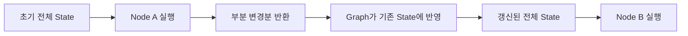

> [!summary]
> **핵심 요약**
> - LangGraph의 `State`는 노드 사이를 직접 흘러가는 단일 output 객체라기보다, 그래프 전체가 공유하는 상태 저장소입니다.
> - 각 노드는 전체 state를 읽고, 바뀐 부분만 partial update 형태로 반환합니다.
> - 다음 노드는 이전 노드의 return만 받는 것이 아니라, 갱신된 전체 state를 입력으로 받습니다.
> - `Reducer`는 같은 state 키에 여러 업데이트가 들어왔을 때 overwrite할지, append할지, merge할지를 정하는 규칙입니다.
> - 특히 `messages`, `steps`, `results` 같은 리스트 필드는 reducer 유무에 따라 동작이 크게 달라집니다.

## 한눈에 보는 흐름



LangGraph를 처음 볼 때 가장 헷갈리는 지점 중 하나는 `State`입니다.  
겉으로 보면 마치 노드 간에 커스텀 객체를 직접 주고받는 것처럼 보이지만, 실제 동작 방식은 조금 다릅니다.

이 글은 다음 질문에서 출발합니다.

- `State`는 정확히 무엇인가?
- 노드의 반환값은 다음 노드의 입력으로 그대로 전달되는가?
- 노드가 전체 상태를 다 반환해야 하는가?
- `Reducer`는 왜 필요한가?

---

## 1. LangGraph에서 State는 무엇인가

가장 먼저 중요한 포인트는 이것입니다.

> LangGraph에서 노드는 서로 직접 객체를 넘겨주는 구조라기보다, 공통의 `State`를 함께 읽고 일부만 갱신하는 구조에 가깝다.

즉 개념적으로 보면:

- `State` = 전체 공유 상태 저장소
- `Node` = 현재 상태를 읽고 일부 변경사항만 반환하는 함수
- `Edge` = 데이터 전달선이라기보다 다음 실행 흐름을 결정하는 연결

많이 하는 오해는 이렇습니다.

> 노드 A의 output 객체가 edge를 타고 노드 B의 input으로 그대로 들어간다.

하지만 LangGraph를 사용할 때는 아래처럼 이해하는 편이 훨씬 정확합니다.

1. 현재 전체 상태가 있다.
2. 노드가 그 상태를 읽는다.
3. 노드는 바뀐 부분만 반환한다.
4. 그래프가 그 반환값을 기존 state에 반영한다.
5. 다음 노드는 갱신된 전체 state를 다시 입력으로 받는다.

---

## 2. State는 전체 상태, 노드의 return은 변경분

예를 들어 다음과 같은 상태가 있다고 해보겠습니다.

```python
from typing_extensions import TypedDict

class State(TypedDict):
    question: str
    answer: str
    steps: list[str]
```

초기 상태가 아래와 같다고 가정합니다.

```python
state = {
    "question": "대한민국의 수도는?",
    "answer": "",
    "steps": []
}
```

이제 어떤 노드가 아래처럼 반환한다고 해보겠습니다.

```python
def answer_node(state: State):
    return {"answer": "대한민국의 수도는 서울입니다."}
```

이때 이 노드가 `State` 전체를 새로 만들어 반환하는 것으로 이해할 필요는 없습니다.  
실제로는 **변경된 부분만 반환하고**, 그래프가 이를 기존 state에 반영합니다.

결과적으로 상태는 이런 식으로 갱신됩니다.

```python
state = {
    "question": "대한민국의 수도는?",
    "answer": "대한민국의 수도는 서울입니다.",
    "steps": []
}
```

즉 다음 한 문장으로 요약할 수 있습니다.

> `State`는 전체 공유 상태이고, 노드는 그중 바뀐 부분만 반환한다.

---

## 3. 그럼 output과 input이 다르면 에러가 나는가?

여기서도 흔한 혼동이 있습니다.

`StateGraph`를 처음 배울 때는 “이전 노드의 output 타입과 다음 노드의 input 타입이 맞아야 한다”라고 생각하기 쉽습니다.

하지만 LangGraph는 보통 그런 식의 1:1 타입 전달 모델이라기보다, **여러 노드가 공통 상태를 공유하는 모델**입니다.

즉 핵심 검증 포인트는 다음에 가깝습니다.

- 반환한 키가 state schema에 맞는가
- 다음 노드가 읽으려는 값이 실제로 state에 존재하는가
- 병렬 노드가 같은 키를 동시에 갱신할 때 충돌이 없는가

예를 들어 이런 코드는 위험합니다.

```python
from typing_extensions import TypedDict

class State(TypedDict):
    question: str
    answer: str


def node_a(state: State):
    return {"foo": 123}


def node_b(state: State):
    return {"answer": state["answer"] + "!"}
```

이 경우 문제의 본질은 “node_a의 output 타입이 node_b input과 다르다”라기보다,

- `foo`는 상태 스키마에 없는 키일 수 있고
- `node_b`는 `answer`가 이미 채워져 있다고 기대하지만 실제로 없을 수 있다는 점

입니다.

즉 LangGraph에서 중요한 것은 **노드 간 객체 전달 타입 불일치**보다 **공유 state의 설계와 갱신 방식**입니다.

---

## 4. Reducer는 왜 필요한가

기본적으로 state의 어떤 키는 새 값이 오면 **덮어쓰기(overwrite)** 되는 식으로 생각하면 됩니다.

그런데 모든 데이터가 덮어쓰기로 처리되면 곤란한 경우가 있습니다.

대표적인 예가:

- 메시지 히스토리 누적
- 중간 실행 단계 누적
- 여러 검색 노드의 결과 합치기

이럴 때 필요한 것이 `Reducer`입니다.

> Reducer는 같은 state 키에 대해 여러 업데이트가 들어왔을 때, 그것을 어떤 규칙으로 합칠지 정의하는 장치다.

---

## 5. Reducer가 없으면 어떻게 되는가

```python
from typing_extensions import TypedDict

class State(TypedDict):
    steps: list[str]


def node_a(state: State):
    return {"steps": ["A 완료"]}


def node_b(state: State):
    return {"steps": ["B 완료"]}
```

이런 식이면 직관적으로는 `steps`가 `["A 완료", "B 완료"]`가 될 것 같지만, reducer가 없다면 보통은 **나중 값으로 덮어쓰기** 되는 방향으로 생각하는 편이 안전합니다.

즉 기대와 다르게 아래처럼 될 수 있습니다.

```python
{"steps": ["B 완료"]}
```

---

## 6. Reducer를 사용한 가장 쉬운 예: 리스트 누적

LangGraph에서 자주 보는 방식은 `Annotated[..., operator.add]` 입니다.

```python
from typing_extensions import TypedDict, Annotated
import operator

class State(TypedDict):
    steps: Annotated[list[str], operator.add]


def node_a(state: State):
    return {"steps": ["A 완료"]}


def node_b(state: State):
    return {"steps": ["B 완료"]}
```

이제 `steps`는 덮어쓰기가 아니라 이어붙이기 방식으로 동작합니다.

실행 흐름을 보면:

1. 초기 state

```python
{"steps": []}
```

2. `node_a` 실행 후

```python
{"steps": ["A 완료"]}
```

3. `node_b` 실행 후

```python
{"steps": ["A 완료", "B 완료"]}
```

즉 `operator.add`를 reducer로 둔 순간, 이 키는 “새 값이 오면 기존 값 뒤에 붙이는 필드”가 됩니다.

---

## 7. messages 필드가 reducer 예제로 자주 쓰이는 이유

LLM 기반 그래프에서는 `messages`를 state에 두는 경우가 많습니다.

```python
from typing_extensions import TypedDict, Annotated
import operator

class State(TypedDict):
    messages: Annotated[list[str], operator.add]


def user_node(state: State):
    return {"messages": ["사용자: 오늘 날씨 어때?"]}


def ai_node(state: State):
    return {"messages": ["AI: 맑을 것 같습니다."]}
```

이 경우 결과는 아래처럼 누적됩니다.

```python
{
    "messages": [
        "사용자: 오늘 날씨 어때?",
        "AI: 맑을 것 같습니다."
    ]
}
```

대화형 agent에서 `messages`를 단순 덮어쓰기 해버리면 직전 메시지밖에 안 남기 때문에, reducer가 매우 중요해집니다.

---

## 8. 병렬 노드에서 reducer가 특히 중요한 이유

Reducer는 병렬 처리에서 더 중요해집니다.

예를 들어 두 개의 검색 노드가 동시에 같은 `results` 키를 채운다고 해보겠습니다.

```python
from typing_extensions import TypedDict, Annotated
import operator

class State(TypedDict):
    query: str
    results: Annotated[list[str], operator.add]


def search_docs(state: State):
    return {"results": ["문서 검색 결과"]}


def search_web(state: State):
    return {"results": ["웹 검색 결과"]}
```

Reducer가 없다면 어느 한쪽 결과가 덮어써질 수 있습니다.  
하지만 `operator.add` 같은 reducer가 있으면 최종 상태는 아래처럼 됩니다.

```python
{
    "query": "langgraph state",
    "results": ["문서 검색 결과", "웹 검색 결과"]
}
```

즉 reducer는 단순 문법 장식이 아니라, **병렬 fan-out/fan-in 구조를 안정적으로 만들기 위한 핵심 도구**입니다.

---

## 9. TypedDict, Pydantic와 연결해서 이해하기

LangGraph를 학습하다 보면 `TypedDict`나 Pydantic도 함께 보게 됩니다.

여기서 기억할 점은 다음 정도면 충분합니다.

### TypedDict

`TypedDict`는 **정해진 키 구조를 가진 dict 타입 힌트**입니다.

```python
from typing import TypedDict

class User(TypedDict):
    name: str
```

- `name`과 `Name`은 서로 다른 키입니다.
- 즉 키 이름은 **대소문자를 구분**합니다.
- 다만 `TypedDict`는 주로 **정적 타입 검사**용이지, 런타임 검증을 강하게 해주는 도구는 아닙니다.

### Pydantic

Pydantic의 일반 모델 필드도 기본적으로는 대소문자를 구분합니다.  
다만 `BaseSettings`처럼 환경변수와 연결되는 경우에는 별도 설정(`case_sensitive=True`) 여부가 관여할 수 있습니다.

LangGraph를 처음 학습할 때는 `State`를 `TypedDict`로 두는 예제가 많기 때문에,

> State는 “엄격한 클래스 객체”라기보다 “정해진 키 구조를 가진 공유 상태 dict”처럼 이해하는 편이 더 직관적이다.

라고 생각하면 도움이 됩니다.

---

## 10. 실무 감각으로 정리하면

LangGraph에서 노드를 설계할 때는 다음 네 가지를 보면 됩니다.

1. 이 노드는 state에서 무엇을 읽는가
2. 이 노드는 state의 어떤 키를 갱신하는가
3. 다음 노드는 그 키를 기대하는가
4. 병렬 노드가 같은 키를 동시에 갱신하는가

즉 node의 입출력을 함수 시그니처처럼만 보기보다,

- **읽는 키**
- **쓰는 키**
- **합치는 규칙**

을 중심으로 생각하는 것이 더 중요합니다.

---

## 11. 한 문장 요약

마지막으로 정말 짧게 요약하면 이렇습니다.

> LangGraph에서 `State`는 전체 공유 상태이고, 노드는 그중 변경분만 반환한다. `Reducer`는 같은 state 키에 대한 여러 업데이트를 어떻게 합칠지 정하는 규칙이다.

처음에는 Node/Edge에만 시선이 가지만, 실제로 그래프를 안정적으로 설계할 때 핵심은 `State`와 `Reducer`입니다.  
이 둘을 이해하면 LangGraph의 동작 방식이 훨씬 선명하게 보이기 시작합니다.
