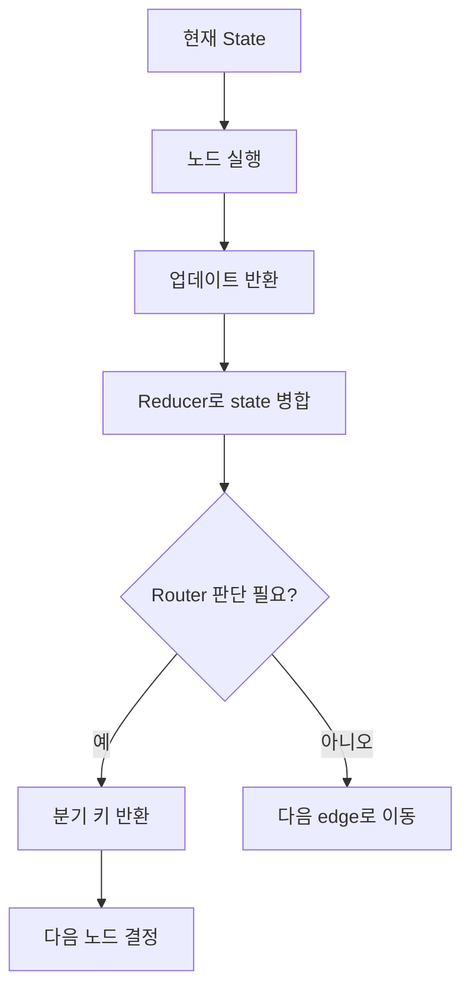
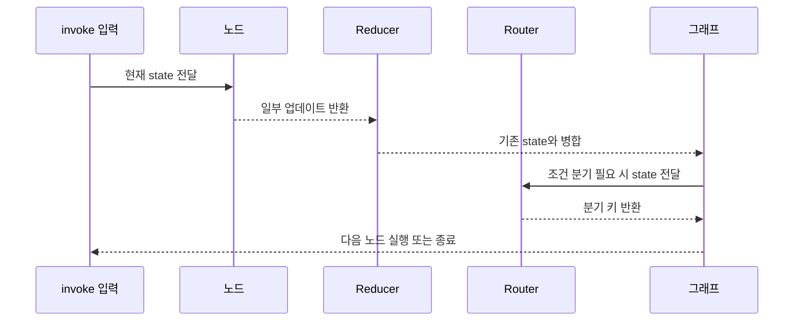

LangGraph를 처음 볼 때 이상하게 자꾸 막히는 포인트가 있습니다. 저도 그랬습니다. `router`는 왜 문자열을 반환하지, `reducer`는 왜 값이 덮어써지지 않고 더해지지, `Annotated`는 대체 타입인지 옵션인지 한참 헷갈렸습니다.

이번 글은 그런 헷갈림을 그대로 살려서 정리한 학습 메모입니다. 공식 문서식 설명보다는, **처음 배울 때 실제로 어디서 오해하는지**를 중심으로 풀어보겠습니다.

> **요약 박스**
>
> - `router`는 보통 **다음 노드를 직접 반환하는 함수**가 아니라, `add_conditional_edges()`가 해석할 **분기 키**를 반환합니다.
> - `reducer`는 state의 같은 필드에 새 값이 들어왔을 때 **기존 값과 어떻게 합칠지 정하는 규칙**입니다.
> - `Annotated[T, X]`는 **T 타입에 X라는 메타데이터를 붙이는 문법**입니다.
> - LangGraph에서는 `Annotated`의 메타데이터를 읽어 `reducer`로 활용합니다.
> - 그래서 노드의 리턴값은 어떤 필드에서는 **최종값**처럼 보이고, 어떤 필드에서는 **변경분**처럼 동작할 수 있습니다.

## 왜 이 세 가지가 같이 헷갈릴까

셋은 사실 연결되어 있습니다.

- `router`는 **흐름 제어**를 담당합니다.
- `reducer`는 **상태 병합**을 담당합니다.
- `Annotated`는 그 병합 규칙을 **타입 정의 위치에 붙이는 문법**입니다.

즉,

1. 노드가 state를 일부 업데이트하고
2. LangGraph가 그 업데이트를 reducer로 합치고
3. 어떤 노드 다음에는 router가 다음 경로를 고릅니다.

처음엔 각각 따로 배우는 것 같지만, 실제 실행 관점에서는 한 흐름입니다.



## 1. router: 왜 문자열을 반환하지?

처음 LangGraph 예제를 보면 이런 코드가 자주 나옵니다.

```python
def router(state):
    if state["numeric_value"] < 5:
        return "branch_a"
    return "__end__"
```

이걸 처음 보면 자연스럽게 이렇게 생각하게 됩니다.

> 아, `router`가 실제 노드 이름을 반환하는구나.

반은 맞고, 반은 틀립니다.

정확히는 `router`의 리턴값은 **분기 결과를 나타내는 문자열 키**입니다. 그리고 그 키를 `add_conditional_edges()`가 해석해서 실제 다음 목적지로 연결합니다.

```python
graph.add_conditional_edges(
    "branch_b",
    router,
    {
        "branch_a": "branch_a",
        "__end__": END,
    }
)
```

이 예제에서 헷갈리는 이유는 **키 이름과 노드 이름을 똑같이 써버렸기 때문**입니다. 그래서 리턴 문자열이 실제 노드 이름처럼 보입니다.

하지만 이렇게 써도 됩니다.

```python
def router(state):
    if state["numeric_value"] < 5:
        return "loop"
    return "finish"

graph.add_conditional_edges(
    "branch_b",
    router,
    {
        "loop": "branch_a",
        "finish": END,
    }
)
```

이제 좀 더 명확합니다.

- `loop`는 노드 이름이 아닙니다.
- `finish`도 노드 이름이 아닙니다.
- 둘 다 **router가 던지는 분기 라벨**입니다.
- 실제 이동은 뒤의 매핑이 결정합니다.

### 제가 헷갈렸던 포인트

제가 처음엔 `router`가 노드 객체나 실제 노드명을 직접 반환한다고 생각했습니다. 그런데 예제를 다시 보면, 핵심은 **리턴 문자열 자체가 아니라 그 문자열을 어떻게 매핑하느냐**였습니다.

즉, `router`는 “다음 노드를 직접 반환한다”기보다, **다음 경로를 고르기 위한 신호를 반환한다**고 이해하는 편이 훨씬 덜 헷갈립니다.

## 2. reducer: 왜 어떤 값은 덮어쓰고 어떤 값은 더해질까

LangGraph의 노드는 보통 state 전체를 다시 만들지 않고, **변경된 일부만 반환**합니다.

```python
def node(state):
    return {"count": 1}
```

여기서 헷갈리는 질문이 생깁니다.

> 그럼 `count`는 1이 되는 건가?
> 아니면 기존 값에 1이 더해지는 건가?

정답은 **state 정의에 달려 있습니다.**

### reducer가 없으면: 기본은 덮어쓰기

```python
class State(TypedDict):
    count: int
```

이 상태에서 노드가 아래처럼 반환하면:

```python
return {"count": 1}
```

의미는 거의 항상 이겁니다.

> `count`를 1로 바꿔라.

즉 **최종값처럼 동작**합니다.

### reducer가 있으면: 기존 값과 합쳐진다

```python
from typing import Annotated, TypedDict
import operator

class State(TypedDict):
    count: Annotated[int, operator.add]
```

이제 같은 리턴값:

```python
return {"count": 1}
```

의 의미가 바뀝니다.

> 기존 `count`에 1을 더해라.

즉 이 경우 리턴값은 **최종값**이 아니라 **업데이트분**처럼 동작합니다.

### 리스트에서는 더 직관적이다

```python
class State(TypedDict):
    items: Annotated[list[str], operator.add]
```

기존 state:

```python
{"items": ["a"]}
```

노드 리턴:

```python
{"items": ["b"]}
```

결과:

```python
{"items": ["a", "b"]}
```

왜냐하면 `operator.add`가 리스트에서는 `+`처럼 동작하기 때문입니다.

### 제가 헷갈렸던 포인트

여기서 가장 크게 헷갈렸던 건 이거였습니다.

> 노드가 리턴한 값은 “이 필드의 새 값”인가, 아니면 “기존 값에 반영할 변경분”인가?

처음엔 모든 필드가 똑같이 동작할 거라고 생각하기 쉽습니다. 그런데 LangGraph는 **필드마다 reducer가 다를 수 있기 때문에**, 같은 `{ "count": 1 }`도 의미가 달라집니다.

이걸 이해하고 나면 reducer는 어렵지 않습니다. 결국 reducer는 **기존값 + 새값 → 최종값**을 만드는 함수일 뿐입니다.

## 3. Annotated: 타입인가 옵션인가

이제 제일 낯설었던 `Annotated`를 보겠습니다.

```python
Annotated[int, operator.add]
```

처음 보면 정말 이상합니다. `int`는 타입인데, `operator.add`는 함수입니다. 이 둘을 왜 한 자리에 같이 쓰는 걸까요?

핵심은 `Annotated`가 **타입을 바꾸는 문법이 아니라, 타입에 메타데이터를 붙이는 문법**이라는 점입니다.

```python
Annotated[T, X]
```

이 형식은 이렇게 읽으면 됩니다.

> 이 값의 실제 타입은 `T`이고, 여기에 `X`라는 추가 정보를 붙여 둔다.

예를 들면:

```python
age: Annotated[int, "0보다 큰 값"]
```

여기서 타입은 여전히 `int`입니다. 문자열 설명은 타입이 아닙니다. 그냥 **추가 정보**입니다.

LangGraph에서는 이 추가 정보를 **reducer**로 읽습니다.

```python
class State(TypedDict):
    items: Annotated[list[str], operator.add]
```

이건 사람 말로 바꾸면 이렇게 됩니다.

> `items`는 문자열 리스트다. 그리고 이 필드는 업데이트가 들어오면 `add` 방식으로 병합해라.

### 파이썬이 자동으로 해주는 건 아니다

여기서 중요한 점이 있습니다.

`Annotated` 자체가 마법처럼 `operator.add`를 자동 실행하는 것은 아닙니다. 파이썬은 그저 “타입은 이거고, 뭔가 메타데이터가 더 있네” 정도만 압니다.

실제로 그 메타데이터를 읽고 의미를 부여하는 건 **LangGraph**입니다.

즉:

- 파이썬 입장: 타입 + 부가정보
- LangGraph 입장: reducer 힌트

### 제가 헷갈렸던 포인트

처음엔 `Annotated`가 타입을 더 복잡하게 만드는 문법처럼 느껴졌습니다. 그런데 나중에 보니 이건 사실 **타입 + 스티커**에 가까웠습니다.

- 상자 안 내용물: 실제 타입
- 상자 겉 스티커: 메타데이터

LangGraph는 그 스티커를 보고 “아, 이건 더하기로 병합해야겠구나”라고 해석하는 셈입니다.

## 한 번에 보면 이렇게 연결된다

지금까지 내용을 하나로 합치면 아래 그림처럼 이해할 수 있습니다.



## LCEL과는 어떻게 다른가

이 부분도 같이 헷갈리기 쉽습니다.

LangChain의 LCEL은 보통 이런 느낌입니다.

```python
chain = prompt | model | parser
```

즉 **직렬 파이프라인**을 표현하는 문법입니다.

반면 LangGraph는:

- 상태를 들고 다니고
- 노드 간 이동을 제어하고
- 조건 분기와 루프를 만들고
- reducer로 상태 병합을 정의합니다.

그래서 감각적으로는 이렇게 구분하면 편합니다.

- **LCEL**: 한 노드 안의 처리 흐름을 만들 때 좋음
- **LangGraph**: 여러 노드의 실행 순서와 상태를 오케스트레이션할 때 좋음

실무에서는 둘을 같이 쓰는 경우가 많습니다. 예를 들어 노드 내부에서 LCEL chain을 돌리고, 바깥에서는 LangGraph가 전체 플로우를 제어하는 식입니다.

## 가장 실전적으로 기억하는 방법

저는 아래처럼 외우는 게 가장 덜 헷갈렸습니다.

### router

> **다음 목적지를 직접 반환한다기보다, 다음 경로를 고르기 위한 라벨을 반환한다.**

### reducer

> **state 필드에 새 값이 들어왔을 때 기존 값과 어떻게 합칠지 정하는 규칙이다.**

### Annotated

> **실제 타입에 LangGraph가 읽을 메타데이터를 붙이는 문법이다.**

## 마무리

LangGraph 입문 초반에는 코드 한 줄 한 줄보다도, **각 요소가 어떤 층위의 역할을 하는지**를 잡는 게 더 중요했습니다.

- `router`는 흐름 제어
- `reducer`는 상태 병합
- `Annotated`는 병합 규칙을 타입 옆에 붙이는 선언

이렇게 역할이 분리된다고 이해하고 나니, 예제 코드가 훨씬 덜 낯설게 보였습니다.

처음엔 “왜 문자열을 리턴하지?”, “왜 1을 리턴했는데 더해지지?”, “왜 타입 옆에 함수가 붙어 있지?” 같은 질문이 자연스럽습니다. 오히려 그 질문을 통과해야 LangGraph가 보이기 시작하는 것 같습니다.

다음 글에서는 이 흐름을 이어서 **`add_edge`, `add_conditional_edges`, `Command`의 차이**까지 묶어서 정리해보겠습니다.
