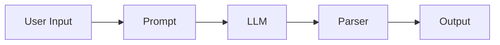
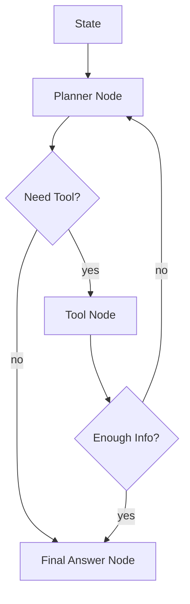
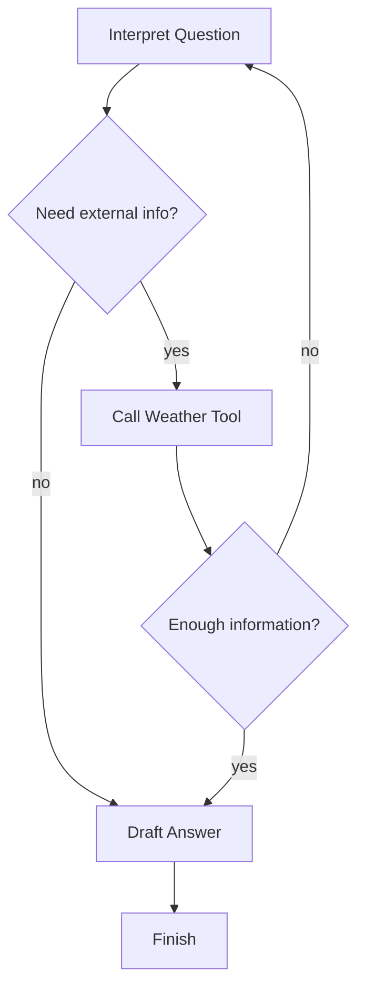
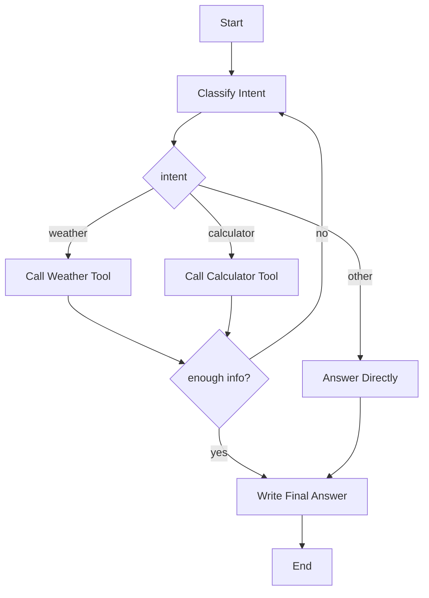

## 한 줄 요약

지금까지의 LangGraph 학습은 문법 암기가 아니라, **agent workflow를 “순서”가 아니라 “상태를 들고 흐르는 그래프”로 사고하는 법**을 익히는 과정에 더 가깝다.

> **요약 박스**
>
> - LangGraph의 핵심은 `State`, `Node`, `Edge`다.
> - LCEL은 선형 체인에는 강하지만, 분기·반복·도구 호출·상태 누적이 섞이는 agent workflow를 다루기엔 답답해진다.
> - `Conditional Edge`는 “어디로 갈지 결정”하는 장치이고, `Cycle`은 “끝날 때까지 다시 시도”하는 장치다.
> - `Reducer`는 여러 노드가 state를 갱신할 때 **덮어쓰기 대신 누적/병합**을 가능하게 한다.
> - `Pydantic BaseModel` 기반 state는 타입과 구조를 명확히 해줘서, 그래프가 커질수록 특히 이점이 커진다.
> - Tool calling은 LLM이 바깥세상과 연결되는 지점이다. 이때부터 agent는 단순 텍스트 생성기가 아니라 **실행 가능한 시스템**에 가까워진다.
> - 여기까지 배운 것만으로도, 날씨 조회 + 계산기 + 조건 분기 + 반복 처리를 가진 작은 agent를 만들 수 있다.

---

## 왜 LangGraph를 배우는가

LangChain이나 LCEL만으로도 간단한 체인은 충분히 만들 수 있다. 프롬프트를 넣고, 모델을 호출하고, 파서를 붙이고, 결과를 내보내는 흐름은 생각보다 빠르게 조립된다.

그런데 조금만 “에이전트스럽게” 가기 시작하면 상황이 달라진다.

예를 들면 이런 요구가 생긴다.

- 질문을 먼저 분류하고 싶다.
- 계산이 필요하면 계산기로 보내고 싶다.
- 외부 정보를 확인해야 하면 tool을 호출하고 싶다.
- 결과가 부족하면 한 번 더 시도하고 싶다.
- 중간 결과를 state에 쌓고 싶다.
- 어떤 조건에서는 종료하고, 어떤 조건에서는 다시 라우팅하고 싶다.

여기서부터는 단순한 “직렬 체인”보다 **상태를 가진 그래프**가 더 자연스럽다.

LangGraph를 배우는 이유는 결국 하나다.

**LLM 호출 몇 번을 연결하는 수준을 넘어, 조건 분기와 반복, 도구 호출, 상태 업데이트를 포함한 agent workflow를 설계하기 위해서다.**

그래서 지금 단계에서 중요한 건 “LangGraph API를 얼마나 많이 외웠는가”가 아니다. 오히려,

> 이 문제를 체인으로 볼 것인가, 그래프로 볼 것인가?

이 감각을 익히는 게 더 중요하다.

---

## 체인에서 그래프로 넘어가는 순간

체인은 보통 이렇게 생각한다.

`입력 -> 처리 1 -> 처리 2 -> 처리 3 -> 출력`

반면 그래프는 이렇게 생각한다.

`현재 상태 -> 어떤 노드를 실행 -> 상태 갱신 -> 조건에 따라 다음 노드 선택 -> 필요하면 다시 반복`

같은 문제도 관점이 바뀐다.



위 구조는 단순 체인에 가깝다.

반면 agent workflow는 보통 아래처럼 변한다.



여기서는 “몇 번째 단계냐”보다, **지금 state가 어떤 상태인가**가 더 중요하다.

---

## LangGraph의 핵심: State / Node / Edge

먼저 큰 그림부터 잡고 가면 편하다.

| 개념 | 무엇인가 | 왜 중요한가 | 비유 |
|---|---|---|---|
| State | 그래프 전체가 공유하는 현재 작업 상태 | 노드들이 서로 결과를 주고받는 공용 메모리 역할 | 작업용 노트 |
| Node | state를 읽고 처리한 뒤 일부를 갱신하는 함수 | 실제 로직이 들어가는 실행 단위 | 작업자 |
| Edge | 다음에 어느 노드로 갈지 연결하는 경로 | 흐름 제어를 담당 | 길/분기점 |

### 1) State

State는 단순히 입력값 하나가 아니다. 보통은 다음을 함께 가진다.

- 사용자 질문
- 지금까지의 중간 결과
- tool 호출 결과
- 에러나 재시도 횟수
- 최종 답변

즉, state는 “현재 이 agent가 어디까지 왔는지”를 나타내는 스냅샷이다.

### 2) Node

Node는 state를 받아서 읽고, 필요한 일을 하고, state 일부를 반환한다.

중요한 포인트는 **노드가 state 전체를 직접 다시 만드는 게 아니라, 보통은 바뀐 부분만 반환한다는 점**이다.

### 3) Edge

Edge는 노드 실행 후 어디로 갈지 정한다. 그냥 직선 연결일 수도 있고, 조건에 따라 갈라지는 `Conditional Edge`일 수도 있다.

---

## 왜 LCEL만으로는 부족해지는가

LCEL은 매우 좋다. 특히 아래 같은 경우에는 정말 편하다.

- 프롬프트 체인 만들기
- 모델과 파서를 깔끔하게 연결하기
- 단일 흐름을 재사용 가능한 컴포넌트로 조합하기

문제는 workflow가 아래처럼 복잡해질 때다.

- 한 번 실행하고 끝나지 않는다.
- 결과에 따라 다른 경로를 타야 한다.
- 필요한 정보가 부족하면 다시 돌아가야 한다.
- 여러 단계에서 같은 state를 읽고 업데이트해야 한다.
- tool 호출 여부를 동적으로 결정해야 한다.

이런 구조를 LCEL로 억지로 밀어붙이면, 코드가 “체인”이라기보다 “분기와 상태를 숨겨놓은 함수 묶음”처럼 되기 쉽다.

결국 불편해지는 지점은 두 가지다.

첫째, **흐름 제어가 눈에 잘 안 들어온다.**
둘째, **상태 관리가 암묵적이 된다.**

LangGraph는 바로 이 부분을 드러내 준다.

- 흐름은 그래프로 보이게 만들고
- 상태는 명시적으로 정의하고
- 분기와 반복을 1급 개념처럼 다룬다

이게 왜 좋냐면, agent 시스템은 시간이 갈수록 “프롬프트”보다 “오케스트레이션”이 더 중요해지기 때문이다.

---

## Conditional Edge와 Cycle이 중요한 이유

여기서부터가 “에이전트 같다”는 느낌이 나는 구간이다.

### Conditional Edge: 어디로 갈지 결정하는 장치

예를 들면 이런 식이다.

- 계산이 필요하면 calculator node로 간다.
- 외부 정보가 필요하면 weather tool node로 간다.
- 충분한 답을 만들 수 있으면 finish node로 간다.

즉, `Conditional Edge`는 **state를 보고 다음 노드를 라우팅**한다.

이게 없으면 agent는 그냥 정해진 순서만 따라가는 파이프라인에 가깝다.

### Cycle: 끝날 때까지 다시 돌리는 장치

반복은 agent workflow에서 거의 필수다.

- tool 결과가 부족하면 다시 질문 해석
- 응답 품질이 낮으면 재시도
- 승인 전까지 대기
- 에러가 나면 복구 후 재실행

이런 구조는 선형 체인으로 표현하기가 번거롭다. 반면 그래프에서는 **노드에서 다시 이전 노드로 돌아가는 edge**를 만들면 된다.

### 둘의 차이

헷갈리기 쉬운데, 둘은 역할이 다르다.

- `Conditional Edge`는 **다음 목적지를 정하는 것**
- `Cycle`은 **이미 지나간 흐름으로 되돌아가는 것**

즉, 라우팅은 선택이고, 루프는 반복이다.



이 그림 하나만 이해해도 LangGraph가 왜 agent 쪽에서 강한지 감이 온다.

---

## Reducer가 왜 필요한가

처음 보면 reducer는 살짝 뜬금없다. 그런데 state를 여러 번 갱신하기 시작하면 바로 필요성이 보인다.

예를 들어 state에 `messages`나 `tool_results` 같은 리스트가 있다고 하자.

노드 A가 결과 하나를 추가하고,
노드 B도 결과 하나를 추가하고,
노드 C도 로그를 남긴다.

이때 아무 설정 없이 업데이트하면 흔히 **덮어쓰기(overwrite)** 가 된다.

그런데 우리가 원하는 건 보통 이쪽이다.

- 기존 값 유지
- 새 결과를 뒤에 누적
- 여러 업데이트를 병합

즉 reducer는 “이 필드를 어떻게 합칠 것인가”를 정의하는 규칙이다.

### reducer가 없는 경우 생기는 문제

- 이전 메시지가 사라진다.
- tool 결과가 마지막 것만 남는다.
- 중간 로그가 덮여서 디버깅이 힘들다.

### 쉽게 말하면

`state[key] = new_value`가 아니라,

`state[key] = merge(old_value, new_value)`

를 명시하는 것이다.

아래 코드는 개념을 단순화한 예시다.

```python
from typing import Annotated
from operator import add
from typing_extensions import TypedDict

class AgentState(TypedDict):
    messages: Annotated[list[str], add]
    tool_results: Annotated[list[str], add]

# Node A returns {"messages": ["질문을 해석했습니다."]}
# Node B returns {"tool_results": ["서울은 맑음"]}
# Node C returns {"messages": ["최종 응답을 작성합니다."]}
```

여기서 `add`는 리스트를 이어붙이는 reducer처럼 동작한다.

이 포인트를 이해하고 나면, state를 단순 변수 모음이 아니라 **시간에 따라 누적되는 작업 기록**으로 보게 된다.

---

## Pydantic BaseModel 기반 state 정의가 주는 이점

초반에는 `TypedDict`만으로도 충분히 시작할 수 있다. 하지만 그래프가 커지면 점점 “상태 구조를 더 엄격하게 잡고 싶다”는 생각이 든다.

이때 `Pydantic BaseModel` 기반 state가 꽤 좋다.

장점은 명확하다.

### 1) 타입이 분명해진다

필드가 무엇인지, 어떤 타입인지, 기본값이 있는지 한눈에 보인다.

### 2) 검증이 된다

실수로 잘못된 타입을 넣었을 때 빨리 알 수 있다.

### 3) 문서 역할을 한다

state 모델 자체가 설계 문서가 된다.

### 4) 그래프가 커질수록 유지보수가 좋아진다

agent가 planner, tool caller, reviewer 등으로 나뉘기 시작하면 state 구조가 흔들리기 쉽다. 이때 모델 기반 정의가 버팀목이 된다.

예를 들면:

```python
from pydantic import BaseModel, Field
from typing import List, Optional

class WeatherResult(BaseModel):
    city: str
    condition: str
    temperature_c: float

class AgentState(BaseModel):
    user_query: str
    intent: Optional[str] = None
    messages: List[str] = Field(default_factory=list)
    weather: Optional[WeatherResult] = None
    calculation_result: Optional[float] = None
    retries: int = 0
    final_answer: Optional[str] = None
```

이렇게 해두면, 지금 이 그래프가 어떤 정보를 가지고 움직이는지 훨씬 선명해진다.

---

## Tool calling: agent가 바깥 세계와 연결되는 지점

여기서부터 LangGraph가 더 재밌어진다.

지금까지는 결국 텍스트 안에서만 머무는 흐름도 가능했다. 하지만 tool calling이 들어오면 얘기가 달라진다.

이제 agent는 다음을 할 수 있다.

- 날씨 API 조회
- 계산 실행
- DB 조회
- 파일 읽기
- 외부 시스템 호출

즉 tool calling은 **LLM이 현실 세계의 기능을 빌려 쓰는 인터페이스**다.

그래서 “단순 함수 호출”과 “tool calling”은 비슷해 보여도 관점이 다르다.

- 함수 호출: 개발자가 그냥 코드 안에서 함수 실행
- tool calling: LLM 또는 agent가 **상황을 해석해 어떤 도구를 쓸지 결정**하고 실행

이 차이가 중요하다.

전자는 프로그램의 제어권이 코드에 있고,
후자는 제어권의 일부가 **state + model 판단 + routing**으로 올라온다.

실무적으로 보면, tool calling이 들어가는 순간부터 agent는 “말 잘하는 모델”이 아니라 **업무를 수행하는 시스템**에 가까워진다.

---

## 지금까지 배운 내용으로 만들 수 있는 작은 예시 agent

여기까지 배운 범위만으로도 꽤 그럴듯한 미니 agent를 만들 수 있다.

요구사항은 이 정도면 충분하다.

- 사용자의 질문이 날씨 관련인지 계산 관련인지 분류
- 날씨면 weather tool 호출
- 계산이면 calculator tool 호출
- 정보가 부족하면 한 번 더 해석
- 결과가 쌓이면 최종 답변 생성

### 흐름 설계



### 예시 코드 1: state와 노드 구조

아래 코드는 개념 설명용으로 단순화한 예시다.

```python
from pydantic import BaseModel, Field
from typing import Optional, List

class AgentState(BaseModel):
    user_query: str
    intent: Optional[str] = None
    messages: List[str] = Field(default_factory=list)
    weather_result: Optional[str] = None
    calculation_result: Optional[float] = None
    retries: int = 0
    final_answer: Optional[str] = None


def classify_intent(state: AgentState) -> dict:
    q = state.user_query.lower()
    if "날씨" in q or "weather" in q:
        return {"intent": "weather", "messages": ["날씨 조회가 필요하다고 판단했습니다."]}
    if any(token in q for token in ["더하기", "곱하기", "+", "-", "*", "/"]):
        return {"intent": "calculator", "messages": ["계산이 필요하다고 판단했습니다."]}
    return {"intent": "other", "messages": ["도구 없이 답변 가능하다고 판단했습니다."]}


def weather_tool_node(state: AgentState) -> dict:
    # 실제로는 외부 weather API 또는 tool 호출
    return {
        "weather_result": "서울은 맑음, 19도",
        "messages": ["날씨 tool을 호출했습니다."]
    }


def calculator_tool_node(state: AgentState) -> dict:
    # 실제로는 안전한 계산 tool 사용 필요
    return {
        "calculation_result": 42.0,
        "messages": ["계산기 tool을 호출했습니다."]
    }


def direct_answer_node(state: AgentState) -> dict:
    return {
        "final_answer": f"질문 '{state.user_query}'에 대해 직접 답변합니다.",
        "messages": ["직접 답변 노드를 실행했습니다."]
    }
```

핵심은 노드가 state 전체를 다시 만드는 게 아니라, **업데이트할 조각만 반환한다**는 점이다.

### 예시 코드 2: 라우팅과 반복 개념

```python
def route_after_classification(state: AgentState) -> str:
    if state.intent == "weather":
        return "weather_tool"
    if state.intent == "calculator":
        return "calculator_tool"
    return "direct_answer"


def route_after_tool(state: AgentState) -> str:
    enough_info = bool(state.weather_result or state.calculation_result)
    if enough_info:
        return "finalize"

    if state.retries >= 1:
        return "finalize"

    return "classify"


def finalize_node(state: AgentState) -> dict:
    if state.weather_result:
        answer = f"조회 결과: {state.weather_result}"
    elif state.calculation_result is not None:
        answer = f"계산 결과: {state.calculation_result}"
    else:
        answer = "현재 정보만으로 가능한 범위에서 답변합니다."

    return {
        "final_answer": answer,
        "messages": ["최종 답변을 생성했습니다."]
    }
```

이 정도만 이해해도 벌써 다음이 보인다.

- retry count를 state로 관리할 수 있고
- tool 결과를 누적할 수 있고
- 조건에 따라 다른 도구로 보내거나 종료할 수 있다

즉, “agent workflow를 그래프로 생각한다”는 말이 코드 레벨에서도 점점 실감난다.

---

## 실무적으로 보면 무엇이 달라지나

지금 단계의 LangGraph를 실무 감각으로 번역하면 아래와 같다.

### 1) state는 실행 컨텍스트다

단순 변수 모음이 아니라, 현재 작업의 맥락과 중간 산출물이 담긴 컨텍스트다.

### 2) node는 역할 기반 작업 단위다

planner, retriever, tool-caller, reviewer처럼 역할을 나누기 좋다.

### 3) edge는 오케스트레이션 규칙이다

이제 중요한 건 프롬프트 하나보다, 어떤 조건에서 어디로 보낼지가 된다.

### 4) reducer는 운영 안정성을 높인다

누적 로그, 중간 결과, message history를 안전하게 다루는 기반이 된다.

### 5) tool calling은 시스템 통합의 시작점이다

여기서부터 agent는 실제 서비스나 업무 시스템과 연결된다.

그래서 LangGraph는 “모델을 더 똑똑하게 쓰는 법”이라기보다, **모델을 포함한 workflow를 설계하는 법**에 가깝다.

---

## 헷갈렸던 포인트

### 1) chain vs graph

처음엔 “둘 다 결국 연결해서 실행하는 거 아닌가?” 싶다. 맞는 말이다. 하지만 차이는 **복잡성이 올라갈 때 어디가 자연스러운가**에 있다.

- chain: 정해진 순서 실행에 강함
- graph: 분기, 반복, 상태 공유에 강함

질문이 “몇 단계를 거치나?”에 머물러 있으면 chain,
질문이 “상태에 따라 어디로 갈까?”로 바뀌면 graph가 더 잘 맞는다.

### 2) 단순 함수 호출 vs tool calling

둘 다 코드 실행처럼 보이지만, tool calling은 agent가 판단해서 도구를 선택하고 호출한다는 점이 다르다.

즉, **함수 호출은 구현 세부**, **tool calling은 agent 설계 요소**에 가깝다.

### 3) state overwrite vs accumulate

이건 실제로 많이 헷갈린다.

노드가 `{ "messages": ["새 로그"] }`를 반환했다고 해서 자동으로 append 되는 게 아니다. 설정에 따라 기존 값을 덮어쓸 수도 있다. 그래서 reducer가 중요하다.

### 4) routing과 loop의 차이

- routing: 다음 노드 선택
- loop: 이전 흐름으로 되돌아감

둘 다 edge로 표현되니 비슷해 보이지만, 사고방식은 다르다.

### 5) state는 입력 객체가 아니라 작업 메모리라는 점

처음에는 state를 “입력 스키마”처럼 보기 쉽다. 그런데 실제로는 **그래프가 움직이는 동안 계속 업데이트되는 실행 상태**에 가깝다.

---

## 직접 해볼 실습

지금 단계에서 해보면 좋은 실습은 아래 정도다.

### 실습 1. 날씨/계산기 라우터 만들기

- 입력 질문을 분류한다.
- 날씨면 weather tool, 수식이면 calculator tool로 보낸다.
- 마지막에 결과를 자연어로 정리한다.

포인트:
- intent를 state에 저장해보기
- `Conditional Edge`로 분기해보기

### 실습 2. 정보가 부족하면 한 번 더 도는 loop 만들기

- 날씨 질문인데 도시명이 없으면 다시 질문 해석 노드로 보낸다.
- `retries`를 state에 넣고 2번 이상이면 종료한다.

포인트:
- loop를 제어하는 기준을 state에 두기
- 무한 반복 방지하기

### 실습 3. reducer로 message log 누적하기

- 각 노드가 실행될 때 로그를 하나씩 남긴다.
- 마지막에 전체 실행 흔적을 출력한다.

포인트:
- overwrite와 accumulate 차이 체감하기

### 실습 4. Pydantic state로 리팩터링하기

- 처음엔 딕셔너리로 만들고
- 그다음 `BaseModel`로 바꿔본다.

포인트:
- 상태 구조가 명확해질수록 디버깅이 쉬워지는지 느껴보기

---

## 다음에 공부할 것

여기까지 오면 다음 주제들이 자연스럽게 이어진다.

### 1) memory

지금 state는 한 실행 안에서만 움직이는 경우가 많다. 다음 단계에서는 “이전 대화나 이전 실행의 정보”를 어떻게 이어받을지가 중요해진다.

### 2) persistence / checkpoint

그래프 실행 도중 멈췄다가 다시 이어가려면 상태를 저장해야 한다. agent를 실제 시스템처럼 다루려면 체크포인트가 거의 필수다.

### 3) human approval

어떤 노드에서는 사람 승인이 필요할 수 있다.

- 메일 발송 전 승인
- PR 생성 전 승인
- 외부 시스템 변경 전 승인

이 지점에서 graph 설계는 더 재미있어진다. 자동화와 통제를 함께 넣을 수 있기 때문이다.

### 4) multi-agent orchestration

planner, executor, reviewer를 분리하는 구조로 가면 사실상 “여러 agent 간 협업 그래프”가 된다. 이때부터는 node 하나하나를 작은 agent처럼 보게 된다.

즉, 지금 배우는 내용은 기초지만, 실제로는 이후의 고급 주제를 떠받치는 바닥 공사에 가깝다.

---

## 마무리

LangGraph를 조금 배우고 나서 가장 크게 바뀐 감각은 이것이다.

예전에는 “프롬프트를 어떻게 잘 짤까?”에 시선이 많이 갔다면,
지금은 “이 작업을 어떤 state와 어떤 routing으로 설계할까?”를 먼저 보게 된다.

이게 꽤 중요하다.

agent workflow에서 성패를 가르는 건 모델 한 번의 출력 품질만이 아니라,

- 어떤 상태를 들고 다니는지
- 어떤 조건에서 분기하는지
- 언제 반복하는지
- 어떤 도구를 어떤 맥락에서 호출하는지

같은 **오케스트레이션 설계**인 경우가 많기 때문이다.

그래서 지금까지의 LangGraph 학습은 아직 화려한 agent를 만든 단계라기보다,
**agent를 그래프로 사고할 수 있게 되는 첫 구간**이라고 보는 게 맞다.

솔직히 말하면, 이쯤 오면 “LangGraph가 왜 필요한지 이제 좀 보인다”는 느낌이 생긴다.

아직 memory도, persistence도, human-in-the-loop도, multi-agent도 본격적으로 들어가진 않았지만, 적어도 그 주제들이 왜 자연스럽게 다음으로 이어지는지는 보이기 시작한다.

그리고 그건 꽤 좋은 출발점이다.

---

## 다음 실습으로 이어가기 위한 체크리스트

- [ ] `State`, `Node`, `Edge`를 내 말로 설명할 수 있다.
- [ ] chain과 graph의 차이를 예시와 함께 설명할 수 있다.
- [ ] `Conditional Edge`가 필요한 이유를 이해했다.
- [ ] loop를 만들 때 종료 조건을 state에 둬야 한다는 점을 이해했다.
- [ ] reducer가 왜 필요한지, overwrite와 accumulate 차이를 설명할 수 있다.
- [ ] `Pydantic BaseModel` state가 왜 유지보수에 유리한지 이해했다.
- [ ] tool calling이 단순 함수 호출과 어떻게 다른지 설명할 수 있다.
- [ ] 날씨 조회 + 계산기 + 조건 분기 + 재시도 1회 정도의 미니 agent를 직접 만들어볼 수 있다.
- [ ] 다음 단계로 memory / checkpoint / human approval / multi-agent가 왜 이어지는지 감이 온다.

이 체크리스트가 어느 정도 체크된다면, 이제부터는 LangGraph의 “기능”보다 “설계”가 더 재미있어질 가능성이 높다.
