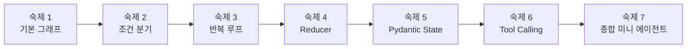

> [!summary]
> **핵심 요약**
> - LangGraph는 문법만 보는 것보다 `state가 흐름을 결정하는 경험`을 직접 해보는 것이 훨씬 중요하다.
> - 처음에는 직선형 그래프부터 시작하고, 그다음 조건 분기, 반복, reducer, Pydantic, tool calling으로 확장하는 순서가 가장 자연스럽다.
> - 숙제는 쉬운 것부터 어려운 것까지 단계적으로 쌓이도록 설계해야 한다.
> - 마지막에는 여러 숙제를 합쳐 작은 에이전트 형태의 미니 프로젝트로 연결해보는 것이 좋다.

## 왜 지금은 숙제가 필요한 시점일까

LangGraph를 처음 배울 때는 `State`, `Nodes`, `Edges` 같은 개념이 꽤 명확해 보입니다. 그런데 막상 손으로 구현하려고 하면 이런 지점에서 자주 멈춥니다.

- 이건 그냥 체인 아닌가?
- conditional edge는 노드 안의 `if`랑 뭐가 다른가?
- cycle은 언제 써야 하지?
- reducer는 왜 필요한가?
- state를 dict로 둘까, Pydantic으로 둘까?
- tool calling은 이론은 알겠는데 실제 코드에서는 어디에 붙어야 하지?

이 시점에는 개념 설명을 더 읽는 것보다, **작게 구현해서 동작을 눈으로 확인하는 숙제**가 훨씬 도움이 됩니다.

이번 글은 아래 범위까지 학습한 뒤에 바로 해볼 수 있는 실전 숙제 세트를 정리한 글입니다.

- State, Nodes, Edges
- Why not just use LCEL?
- Cycles & Conditional Edges
- Reducer Functions
- State with Pydantic BaseModel
- Tool Calling Theory
- Tool Calling in Practice

---

## 이 글의 숙제 설계 원칙

이번 숙제는 단순히 문제를 푸는 용도가 아닙니다. 각 과제가 **하나의 개념을 몸으로 익히게 만드는 구조**를 갖도록 설계했습니다.

### 설계 원칙

1. **직접 Python으로 구현해야 한다**  
   눈으로 읽고 끝나는 문제가 아니라, 실행 가능한 코드가 나와야 합니다.

2. **난이도는 점진적으로 올라가야 한다**  
   처음부터 agent를 만들면 오히려 핵심이 흐려집니다.

3. **각 숙제는 하나의 핵심 개념을 분명히 체감하게 해야 한다**  
   예를 들어 reducer 숙제는 “왜 덮어쓰기가 아니라 merge 규칙이 필요한가”를 직접 느끼게 해야 합니다.

4. **마지막에는 하나의 미니 프로젝트로 수렴해야 한다**  
   학습한 개념이 따로 놀지 않고 연결되어야 오래 남습니다.

---

## 전체 로드맵



이 순서가 중요한 이유는 간단합니다.

처음에는 **흐름 자체를 이해**해야 하고, 그다음 **흐름이 갈라지고**, 그다음 **다시 돌아오고**, 그다음 **상태를 합치고**, 그다음 **상태를 더 엄격하게 정의**하고, 마지막에야 **도구를 사용하는 작은 에이전트**로 가는 편이 훨씬 자연스럽기 때문입니다.

---

# 숙제 1. 단일 흐름 그래프 만들기

## 목표

가장 기본적인 LangGraph 감각을 익히는 숙제입니다.

- `State`를 정의하고
- `Node`가 상태를 읽어 일부를 갱신하고
- `Edge`를 따라 다음 단계로 흐르는

아주 단순한 그래프를 직접 구현해봅니다.

## 구현 요구사항

주제는 **사용자 입력을 정리하고 요약한 뒤 분류하는 그래프**입니다.

### 상태 필드

- `user_input: str`
- `cleaned_input: str`
- `summary: str`
- `category: str`

### 노드 구성

- `clean_input`
  - 입력 문자열 앞뒤 공백 제거
  - 연속 공백 하나로 정리
- `make_summary`
  - 입력을 한 줄 요약
- `classify_text`
  - 입력을 아래 셋 중 하나로 분류
    - `question`
    - `request`
    - `statement`

### 그래프 흐름

`START -> clean_input -> make_summary -> classify_text -> END`

### 추가 조건

- 각 노드는 state 일부만 업데이트해야 합니다.
- Python 파일 하나에서 실행 가능해야 합니다.

## 힌트

처음부터 LLM을 붙이지 않아도 충분합니다.

- `?`가 있으면 `question`
- `해줘`, `작성해` 같은 표현이 있으면 `request`
- 나머지는 `statement`

이 숙제의 핵심은 정확한 분류기가 아니라, **노드가 전체 state를 읽고 일부만 바꾼다는 감각**입니다.

## 제출물 형태

- `homework1_basic_graph.py`
- 실행 결과 로그
- 상태 정의와 노드 설명 메모

## 스스로 점검할 체크리스트

- [ ] 상태를 중심으로 흐름을 설계했는가
- [ ] 각 노드가 하나의 책임만 가지는가
- [ ] 변경된 필드만 반환하도록 구현했는가
- [ ] 이건 직선형 체인에 가깝다는 점을 설명할 수 있는가

---

# 숙제 2. Conditional Routing 넣기

## 목표

이번에는 그래프가 단순 직선형이 아니라, **상태 값에 따라 다음 노드가 달라지는 구조**를 구현합니다.

핵심은 이것입니다.

> 그래프 레벨 분기는 노드 안의 `if`문보다 흐름이 더 명확하게 보인다.

## 구현 요구사항

주제는 **사용자 요청 성격에 따라 다른 처리 경로로 보내는 그래프**입니다.

### 상태 필드

- `user_input: str`
- `intent: str`
- `result: str`

### 노드 구성

- `detect_intent`
  - 아래 셋 중 하나로 분류
    - `qa`
    - `write`
    - `chat`
- `answer_question`
- `write_content`
- `general_chat`

### 그래프 흐름

`START -> detect_intent`

이후 조건 분기:

- `qa`면 `answer_question`
- `write`면 `write_content`
- `chat`이면 `general_chat`

각 처리 노드 이후에는 `END`

### 추가 조건

- `add_conditional_edges`를 사용합니다.
- 분기 함수는 state를 읽고 다음 노드 이름을 반환하게 작성합니다.

## 힌트

분기 기준은 아주 단순해도 됩니다.

- `?` 포함 → `qa`
- `써줘`, `작성` 포함 → `write`
- 그 외 → `chat`

핵심은 **노드 내부에서 전부 처리하지 말고, 그래프가 라우팅을 맡게 만드는 것**입니다.

## 제출물 형태

- `homework2_conditional_routing.py`
- 3개 이상의 입력 예시와 실행 결과
- 분기 규칙 설명

## 스스로 점검할 체크리스트

- [ ] 조건 분기를 그래프 레벨에서 구현했는가
- [ ] 입력에 따라 다른 경로를 타는가
- [ ] LCEL 직선 체인으로 만들었을 때 왜 덜 자연스러운지 설명할 수 있는가
- [ ] 노드 내부 `if`와 conditional edge의 차이를 말할 수 있는가

---

# 숙제 3. Cycle을 이용한 반복 개선 루프 만들기

## 목표

이 숙제의 핵심은 **그래프가 한 번 실행되고 끝나는 것이 아니라, 조건이 만족될 때까지 돌아갈 수 있다**는 점을 체감하는 것입니다.

## 구현 요구사항

주제는 **짧은 글을 평가하고 기준 미달이면 다시 수정하는 루프**입니다.

### 상태 필드

- `topic: str`
- `draft: str`
- `score: int`
- `feedback: str`
- `revision_count: int`

### 노드 구성

- `write_draft`
  - 주제에 대한 초안 작성
- `review_draft`
  - 초안을 평가해서 점수 부여
- `revise_draft`
  - 피드백 반영해 수정
- `should_continue`
  - 점수 기준 미달이면 반복, 이상이면 종료

### 그래프 흐름

`START -> write_draft -> review_draft`

이후 분기:

- `score >= 7` → `END`
- `score < 7` → `revise_draft -> review_draft`

### 추가 조건

- `revision_count`가 3회를 넘으면 강제 종료합니다.
- 반복 횟수와 점수가 로그로 보이게 만듭니다.

## 힌트

이 숙제는 결과 품질보다 **루프 구조가 눈에 보이는지**가 더 중요합니다.

예를 들면:

- 글 길이가 너무 짧으면 감점
- 핵심 키워드가 빠지면 감점
- 피드백 문구를 바탕으로 revise 단계에서 문장을 추가

이런 규칙 기반 구현으로도 충분합니다.

## 제출물 형태

- `homework3_cycle_revision.py`
- 실행 로그
- 서로 다른 주제 2개 이상 테스트 결과

## 스스로 점검할 체크리스트

- [ ] 그래프 안에 cycle이 실제로 들어갔는가
- [ ] 종료 조건이 분명한가
- [ ] 무한 루프 방지 장치가 있는가
- [ ] 반복할수록 state가 실제로 변하는가

---

# 숙제 4. Reducer를 체감하는 병렬 수집 그래프 만들기

## 목표

이 숙제는 reducer를 말로 이해하는 게 아니라, **없을 때 어떤 문제가 생기는지 직접 본 다음 필요성을 체감**하는 데 목적이 있습니다.

## 구현 요구사항

주제는 **하나의 질문에 대해 여러 관점의 답변 조각을 모으는 그래프**입니다.

### 상태 필드

- `question: str`
- `answers: list[str]`
- `final_answer: str`

### 노드 구성

- `generate_pros`
  - 장점 관점 답변 1~3개 생성
- `generate_cons`
  - 단점 관점 답변 1~3개 생성
- `generate_neutral`
  - 중립 정리 1~3개 생성
- `merge_answer`
  - `answers`를 바탕으로 최종 응답 생성

### 그래프 요구

하나의 시작점에서 아래 세 노드가 모두 `answers` 필드에 값을 추가하게 만듭니다.

- `generate_pros`
- `generate_cons`
- `generate_neutral`

그다음 `merge_answer`로 모읍니다.

### 핵심 조건

- 처음에는 reducer 없이 구현해봅니다.
- 그다음 reducer를 넣어서 동작 차이를 비교합니다.

## 힌트

가장 쉬운 형태는 `operator.add`를 이용한 리스트 병합입니다.

이 숙제의 질문은 사실 하나입니다.

> 여러 노드가 같은 state key를 갱신할 때, 그 값을 어떤 규칙으로 합쳐야 하는가?

## 제출물 형태

- `homework4_reducer_merge.py`
- reducer 없는 버전과 있는 버전 비교 메모
- 실행 결과

## 스스로 점검할 체크리스트

- [ ] reducer가 왜 필요한지 사례로 설명할 수 있는가
- [ ] 같은 key를 여러 노드가 건드릴 때 문제를 관찰했는가
- [ ] reducer 적용 후 결과가 어떻게 달라졌는가
- [ ] `messages` 같은 히스토리 누적에도 연결해서 이해했는가

---

# 숙제 5. Pydantic State로 상태를 더 엄격하게 만들기

## 목표

이제 느슨한 dict 기반 state에서 한 단계 올라가, **Pydantic BaseModel 기반 state**로 바꿔보는 숙제입니다.

핵심은 상태가 커질수록 **타입과 검증이 왜 중요한지** 직접 느끼는 것입니다.

## 구현 요구사항

주제는 **간단한 리서치 워크플로우 상태 모델링**입니다.

### 상태 필드 예시

- `topic: str`
- `sub_questions: list[str] = []`
- `collected_notes: list[str] = []`
- `report: str | None = None`
- `status: Literal["init", "researching", "writing", "done"]`
- `iteration: int = 0`

### 노드 구성

- `plan_research`
  - 주제를 바탕으로 하위 질문 3개 생성
- `collect_notes`
  - 하위 질문별 간단 메모 수집
- `write_report`
  - 메모 기반으로 짧은 보고서 작성
- `mark_done`

### 추가 조건

- 의도적으로 validation error도 한 번 만들어봅니다.
  - `iteration`에 문자열 넣기
  - `status`에 허용되지 않은 값 넣기
- 각 단계에서 `status`가 자연스럽게 바뀌게 만듭니다.

## 힌트

이 숙제에서 중요한 것은 단지 Pydantic 문법이 아닙니다.

상태 구조가 커질수록,

- 어떤 필드가 있는지
- 어떤 값이 허용되는지
- 어느 단계에서 값이 채워지는지

가 더 분명해진다는 점을 느껴보는 것이 핵심입니다.

## 제출물 형태

- `homework5_pydantic_state.py`
- state 정의 코드
- 정상 실행 예시
- 검증 실패 예시

## 스스로 점검할 체크리스트

- [ ] 상태 스키마를 코드 차원에서 명확히 정의했는가
- [ ] 어떤 필드가 어느 단계에서 채워지는지 설명할 수 있는가
- [ ] dict state 대비 장단점을 말할 수 있는가
- [ ] 상태가 커질수록 Pydantic이 왜 유리한지 설명할 수 있는가

---

# 숙제 6. Tool Calling 없는 버전 vs 있는 버전 비교하기

## 목표

이번 숙제는 **tool calling의 필요성을 비교 실험으로 느끼는 과제**입니다.

같은 문제를

- 도구 없이 처리하는 버전
- 도구를 호출하는 버전

두 가지로 만들어보고 차이를 확인합니다.

## 구현 요구사항

주제는 **간단한 계산/조회 도우미**입니다.

### 상태 필드

- `user_input: str`
- `needs_tool: bool`
- `tool_result: str`
- `final_answer: str`

### 준비할 도구

최소 2개 이상 구현합니다.

- `calculator_tool(expression: str) -> str`
- `word_count_tool(text: str) -> str`
- 선택 도구
  - `date_tool()`
  - `fake_search_tool(query: str)`

### 노드 구성

- `analyze_request`
  - 도구가 필요한지 판단
- `call_tool`
  - 필요한 도구 실행
- `respond_without_tool`
- `respond_with_tool`

### 그래프 흐름

`START -> analyze_request`

이후 분기:

- tool 필요 → `call_tool -> respond_with_tool -> END`
- tool 불필요 → `respond_without_tool -> END`

### 비교 입력 예시

- `123 * 45 계산해줘`
- `이 문장의 단어 수를 세줘: LangGraph is fun`
- `LangGraph가 뭐야?`

## 힌트

이 숙제의 목적은 “모델이 계산을 못한다”를 증명하는 것이 아닙니다.

핵심은 이것입니다.

> 어떤 종류의 요청은 도구를 명시적으로 호출했을 때 훨씬 안정적이고 예측 가능해진다.

## 제출물 형태

- `homework6_tool_calling_compare.py`
- 도구 없는 결과 / 도구 있는 결과 비교 표
- 짧은 회고

## 스스로 점검할 체크리스트

- [ ] 어떤 요청에서 tool calling이 필요한지 구분했는가
- [ ] 도구 호출 전후 역할 분리가 명확한가
- [ ] 도구 결과를 state에 저장했는가
- [ ] 최종 응답이 tool 결과를 바탕으로 만들어지는가

---

# 숙제 7. 조건 분기 + cycle + tool calling을 합친 작은 에이전트 만들기

## 목표

마지막 숙제는 지금까지 배운 핵심을 하나로 묶는 종합 과제입니다.

여기서부터는 “LangGraph 문법 연습”보다 **그래프 기반 에이전트 사고**가 더 중요해집니다.

## 구현 요구사항

주제는 **질문 해결형 미니 에이전트**입니다.

### 동작 예시

사용자의 질문을 받아서,

1. 질문 유형을 분류하고
2. 필요한 경우 도구를 호출하고
3. 답변 초안을 만들고
4. 스스로 검토하고
5. 점수가 낮으면 수정하고
6. 만족하면 종료합니다.

### 상태 예시

Pydantic state로 아래 필드를 정의합니다.

- `user_input: str`
- `intent: str`
- `messages: list[str]`
- `tool_result: str | None`
- `draft_answer: str | None`
- `review_score: int | None`
- `review_feedback: str | None`
- `attempts: int = 0`
- `done: bool = False`

### 필수 요소

- **conditional routing**
  - 질문형 / 계산형 / 일반형 분기
- **tool calling**
  - 계산형이면 calculator tool 사용
- **cycle**
  - 리뷰 점수가 낮으면 다시 수정
- **reducer**
  - `messages` 혹은 `logs` 누적
- **Pydantic state**
  - 상태 정의를 엄격하게

## 힌트

이 숙제는 “똑똑한 agent를 만드는 것”보다, **그래프 구조를 직접 조립하는 것**이 더 중요합니다.

리뷰 로직은 규칙 기반이어도 충분합니다.

예를 들면:

- 답변 길이 검사
- tool 결과가 실제로 반영됐는지 검사
- 질문과 관련된 키워드가 있는지 검사

## 제출물 형태

- `homework7_mini_agent.py`
- 그래프 구조 설명
- 테스트 입력 3개 이상
- 각 입력이 어떤 경로를 탔는지 로그

## 스스로 점검할 체크리스트

- [ ] 단순 체인이 아니라 그래프다운 흐름이 있는가
- [ ] 상태가 흐름 제어의 중심 역할을 하는가
- [ ] 조건 분기와 반복 구조가 자연스럽게 연결되는가
- [ ] 도구 호출이 실제로 의미 있게 들어갔는가
- [ ] reducer가 히스토리 누적에 잘 쓰였는가

---

## 추천 진행 순서

아래 순서대로 하면 가장 자연스럽습니다.

1. 숙제 1 — 기본 그래프
2. 숙제 2 — 조건 분기
3. 숙제 3 — 반복 루프
4. 숙제 4 — reducer
5. 숙제 5 — Pydantic state
6. 숙제 6 — tool calling
7. 숙제 7 — 종합 미니 에이전트

---

## 권장 폴더 구조

```bash
langgraph-homeworks/
├─ homework1_basic_graph.py
├─ homework2_conditional_routing.py
├─ homework3_cycle_revision.py
├─ homework4_reducer_merge.py
├─ homework5_pydantic_state.py
├─ homework6_tool_calling_compare.py
├─ homework7_mini_agent.py
└─ README.md
```

README에는 아래 내용을 적어두면 복습할 때 도움이 됩니다.

- 숙제 목표
- 실행 방법
- 실행 결과
- 어려웠던 점
- 다음 개선 포인트

---

## 이 숙제들을 합쳐 만들 수 있는 미니 프로젝트

마지막으로 이 숙제들을 따로 두지 말고, 하나의 작은 프로젝트로 연결해보면 좋습니다.

### 프로젝트 제안: LangGraph 기반 질문 해결 도우미

이 프로젝트는 사용자 입력을 받아서,

- 질문인지
- 계산 요청인지
- 작성 요청인지

판단한 뒤, 필요한 경우 도구를 호출하고, 답변 초안을 만들고, 스스로 검토하고, 부족하면 다시 수정하는 **작은 그래프 기반 에이전트**입니다.

### 이 프로젝트에서 자연스럽게 들어가는 요소

- **graph 기반 흐름**  
  단순 체인 대신 상태 중심 제어 흐름
- **conditional routing**  
  입력 유형에 따라 다른 노드로 이동
- **cycles**  
  답변 품질이 낮으면 다시 수정
- **reducer**  
  메시지 로그와 intermediate notes 누적
- **Pydantic state**  
  상태 구조를 명확하게 문서화
- **tool calling**  
  계산, 텍스트 분석, 간단 조회 도구 연결

### 최소 기능

- 입력 분류
- 도구 사용 여부 판단
- 답변 생성
- 리뷰 및 재작성
- 최종 결과와 중간 로그 출력

### 다음 확장 아이디어

- memory 추가
- human-in-the-loop 승인 노드 추가
- 여러 tool 중 하나를 고르는 routing 추가
- planner / worker / reviewer로 나누는 멀티 에이전트 구조 확장

---

## 마무리

지금 단계에서는 LangGraph를 더 많이 읽는 것보다 아래 두 가지를 분명히 느끼는 것이 더 중요합니다.

1. **state가 흐름을 결정한다**
2. **그래프는 체인보다 유연하다**

특히 숙제 3, 4, 7까지 직접 구현해보면, 왜 LangGraph가 에이전트 구현에서 자주 언급되는지 감이 꽤 또렷해집니다.

처음에는 작은 예제로 시작해도 괜찮습니다. 중요한 건 복잡한 데모를 한 번에 만드는 것이 아니라, **흐름이 보이는 코드**를 여러 번 직접 써보는 것입니다.
